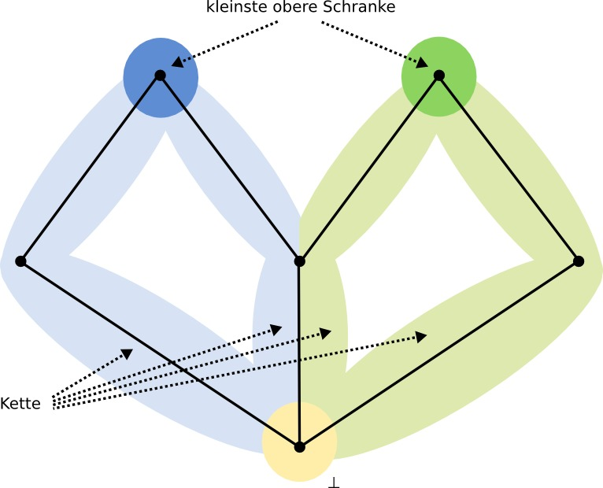

% Semantik von Programmiersprachen
% Christian Cikryt (4285814), Martin Lenders (4206090), Jakob Pfender (4282720)

Übungsblatt 7
=============

Aufgabe 1
---------

Wir beweisen, dass die gegebene Struktur ein CPO ist, indem wir zeigen,
dass die drei Kriterien aus dem Buch (Seite 59, Def. 3.3) gelten:

1. Gilt trivialerweise, da eine Halbordnung auch diese Kriterien
   erfüllen muss.
2. Gilt nach Annahme.
3. Wir nehmen an, es gibt für eine Kette $K$ keine kleinste obere
   Schranke. Dann existiert für alle $k$ in $K$ ein $k'$, so dass $k' >
   k$. Damit wäre die Menge nicht beschränkt => Widerspruch.

Aufgabe 2
---------

a) $A$ ist ein CPO, da eine Halbordnung darauf definiert werden kann,
ein minimales Element existiert und jede Kette in $A$ eine kleinste
obere Schranke besitzt. Die ersten beiden Bedingungen gelten
trivialerweise; dass die dritte Bedingung gilt, lässt sich unter
Zuhilfenahme des Beweises aus Aufgabe 1 und der Tatsache, dass $A$
endlich ist, herleiten.

b) $A$ ist keine Kette; $A$ enthält aber Ketten.

c) Es existiert keine kleinste obere Schranke von $A$ - es existieren
nur kleinste obere Schranken der Ketten in A.

Aufgabe 3
---------

1. Die Vergleichsoperation über die natürlichen Zahlen $N$. Für die
   einzige Kette dieser Relation gibt es keine kleinste obere Schranke.
2. Die Teilgraphrelation (d.h.: $G_1 \leq G_2$ gdw. $G_1$ isomorph zu
   einem Teilgraphen von $G_2$) über die Menge aller endlichen
   nichtleeren Graphen, wobei der Graph mit nur einem Knoten das
   Bottom-Element ist. In dieser Menge gibt es keine kleinste obere
   Schranke für irgendeine Kette, da man stets eine weitere Kante mit
   einem Knoten anfügen kann.

Aufgabe 4
---------

$f(x) = \begin{cases} x, & \text{wenn } f(x) \mod 2 = x \\ 0, &
\text{wenn } f(x) \mod 2 \neq x \end{cases}$

$L = \{ x \rightarrow 0, x \rightarrow \bot \}$
